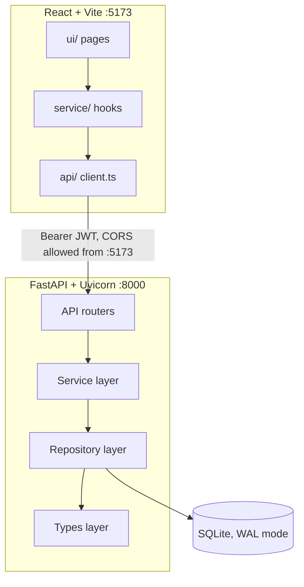
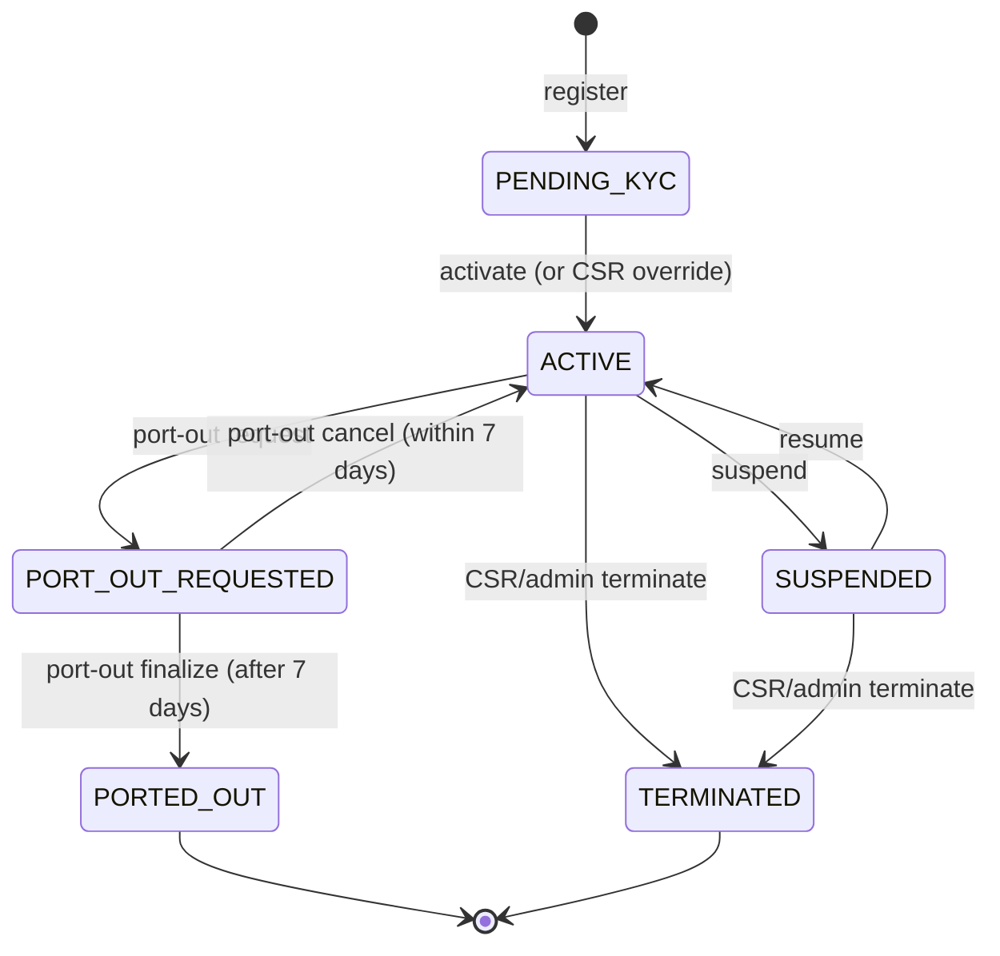
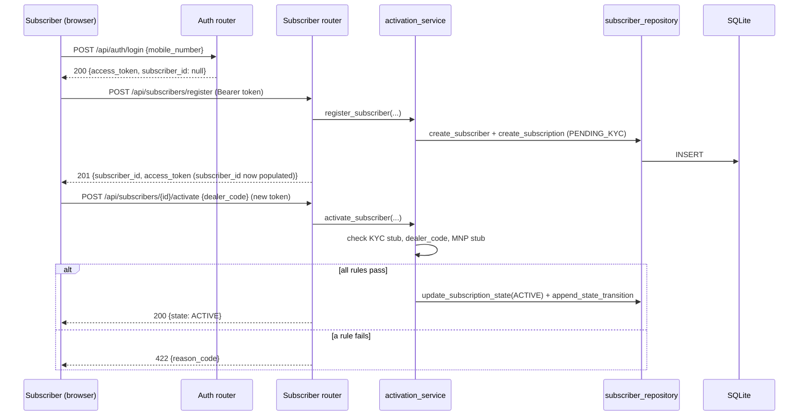

# Architecture — TelcoLane

## Layers (one-way imports only)

```
Types → Config → Repository → Service → API → UI
```

No layer imports from a layer above it, enforced by `.claude/hooks/check-architecture.js` on every file save. Frontend mirrors the same chain: `types/ → config/ → api/ (the only layer that calls fetch()) → service/ (hooks) → ui/`.

## System Context



## Subscriber Lifecycle (the state machine every mutating service shares)



Defined once as a declarative `frozenset[tuple[SubscriberState, SubscriberState]]` in `backend/src/app/types/fsm.py`. Every service that moves a subscription — activation, suspend/resume, port-out, termination, CSR override — calls this one `transition()` function. An edge not in the table raises `InvalidSubscriberStateException`, mapped to HTTP 409 by `error_handlers.py`.

## Activation → Port-Out Sequence (representative end-to-end flow)



## Component Map

| Component | Technology | Responsibility |
|---|---|---|
| Backend API | FastAPI + Uvicorn | All business logic, persistence, auth, reporting |
| Database | SQLite (WAL mode) | Single-file store; append-only tables for ledgers |
| Frontend SPA | React + Vite + TypeScript | Subscriber self-service, admin/CSR internal tools |
| Stub integrations | In-process config flags | Deterministic KYC/dealer/MNP outcomes, no network calls |

## Key Design Decisions

1. **Table-driven FSM in the Types layer** (see above) — one authority for transition legality, not five duplicated checks.
2. **Append-only enforced at two levels** — no update/delete repository function for ledger tables, *plus* a database trigger as defense-in-depth against a raw-SQL bypass.
3. **PII masking is structural** — `logging_service.py` is the only module that serializes a log payload; masking cannot be forgotten per call-site.
4. **Decimal everywhere for money** — stored as canonical `TEXT` in SQLite (no native decimal type), reconstructed as `Decimal` on read.
5. **Pro-rata billing as a pure function** — `billing_calculation_service.calculate_pro_rata_charge` has no I/O; preview and commit call the identical function, so they can never disagree.
6. **CSR override as a re-run, not a bypass** — re-invokes the same authoritative service function with one rule suppressed, so the FSM and append-only writes still go through their single normal code path.
7. **Role-based auth at the controller layer** — `require_role`/`require_own_subscriber` dependencies, with the admin-reporting service re-checking its own role requirement independently of the router (the one deliberate exception, since unauthorized report access is treated as high-severity).

## Known Gaps (honestly, not swept under the rug)

- No `src/domain/` directory with dedicated rule/policy/validator files — domain rules live inside the relevant service files (`activation_service.py`'s rule sequence, `plan_change_service.py`'s tenure check, `fsm.py`'s transition table) rather than a separate domain layer.
- No `import-linter`/`dependency-cruiser` config yet — layering is enforced by a custom pre-save hook (`check-architecture.js`), not a dedicated architecture-test tool.
- `main` branch lagged `develop` by several commits as of this writing (all of Group F/G's work landed on `develop` only) — see `claude-progress.txt` for the exact catch-up status.
