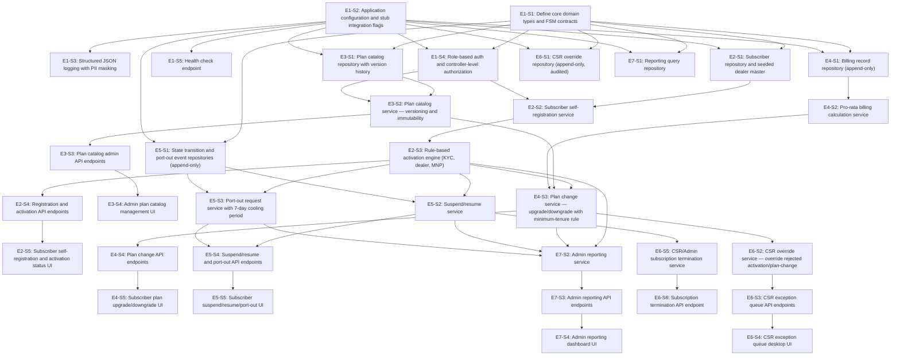

# Dependency Graph — TelcoLane

Stories are organized into sequential execution groups (A earliest, H latest).
Stories within the same group have no dependency on each other and can be built
in parallel; each group depends only on stories in earlier groups. No circular
dependencies exist — verified by construction (every `depends_on` reference points
strictly to an earlier group).

## Mermaid Diagram

## Group A

| Story ID | Title | Layer | Depends On |
|---|---|---|---|
| E1-S1 | Define core domain types and FSM contracts | Types | — |
| E1-S2 | Application configuration and stub integration flags | Config | — |

## Group B

| Story ID | Title | Layer | Depends On |
|---|---|---|---|
| E1-S3 | Structured JSON logging with PII masking | Service | E1-S2 |
| E1-S4 | Role-based auth and controller-level authorization | API | E1-S1, E1-S2 |
| E1-S5 | Health check endpoint | API | E1-S2 |
| E2-S1 | Subscriber repository and seeded dealer master | Repository | E1-S1, E1-S2 |
| E3-S1 | Plan catalog repository with version history | Repository | E1-S1, E1-S2 |
| E4-S1 | Billing record repository (append-only) | Repository | E1-S1, E1-S2 |
| E5-S1 | State transition and port-out event repositories (append-only) | Repository | E1-S1, E1-S2 |
| E6-S1 | CSR override repository (append-only, audited) | Repository | E1-S1, E1-S2 |
| E7-S1 | Reporting query repository | Repository | E1-S1, E1-S2 |

## Group C

| Story ID | Title | Layer | Depends On |
|---|---|---|---|
| E2-S2 | Subscriber self-registration service | Service | E2-S1, E1-S4 |
| E3-S2 | Plan catalog service — versioning and immutability | Service | E3-S1, E1-S4 |
| E4-S2 | Pro-rata billing calculation service | Service | E4-S1 |

## Group D

| Story ID | Title | Layer | Depends On |
|---|---|---|---|
| E2-S3 | Rule-based activation engine (KYC, dealer, MNP) | Service | E2-S2 |
| E3-S3 | Plan catalog admin API endpoints | API | E3-S2 |

## Group E

| Story ID | Title | Layer | Depends On |
|---|---|---|---|
| E2-S4 | Registration and activation API endpoints | API | E2-S3 |
| E3-S4 | Admin plan catalog management UI | UI | E3-S3 |
| E4-S3 | Plan change service — upgrade/downgrade with minimum-tenure rule | Service | E2-S3, E3-S2, E4-S2 |
| E5-S2 | Suspend/resume service | Service | E2-S3, E5-S1 |
| E5-S3 | Port-out request service with 7-day cooling period | Service | E2-S3, E5-S1 |

## Group F

| Story ID | Title | Layer | Depends On |
|---|---|---|---|
| E2-S5 | Subscriber self-registration and activation status UI | UI | E2-S4 |
| E4-S4 | Plan change API endpoints | API | E4-S3 |
| E5-S4 | Suspend/resume and port-out API endpoints | API | E5-S2, E5-S3 |
| E6-S2 | CSR override service — override rejected activation/plan-change | Service | E4-S3 |
| E6-S5 | CSR/Admin subscription termination service | Service | E5-S2 |
| E7-S2 | Admin reporting service | Service | E2-S3, E4-S3, E5-S2, E5-S3 |

## Group G

| Story ID | Title | Layer | Depends On |
|---|---|---|---|
| E4-S5 | Subscriber plan upgrade/downgrade UI | UI | E4-S4 |
| E5-S5 | Subscriber suspend/resume/port-out UI | UI | E5-S4 |
| E6-S3 | CSR exception queue API endpoints | API | E6-S2 |
| E6-S6 | Subscription termination API endpoint | API | E6-S5 |
| E7-S3 | Admin reporting API endpoints | API | E7-S2 |

## Group H

| Story ID | Title | Layer | Depends On |
|---|---|---|---|
| E6-S4 | CSR exception queue desktop UI | UI | E6-S3 |
| E7-S4 | Admin reporting dashboard UI | UI | E7-S3 |

## Cycle Check

No cycles are possible: every story's `depends_on` list references only stories in
a strictly earlier group (A < B < C < D < E < F < G < H), which is a topological
ordering by construction. Validated by traversal: no story ID appears in its own
transitive dependency set.

